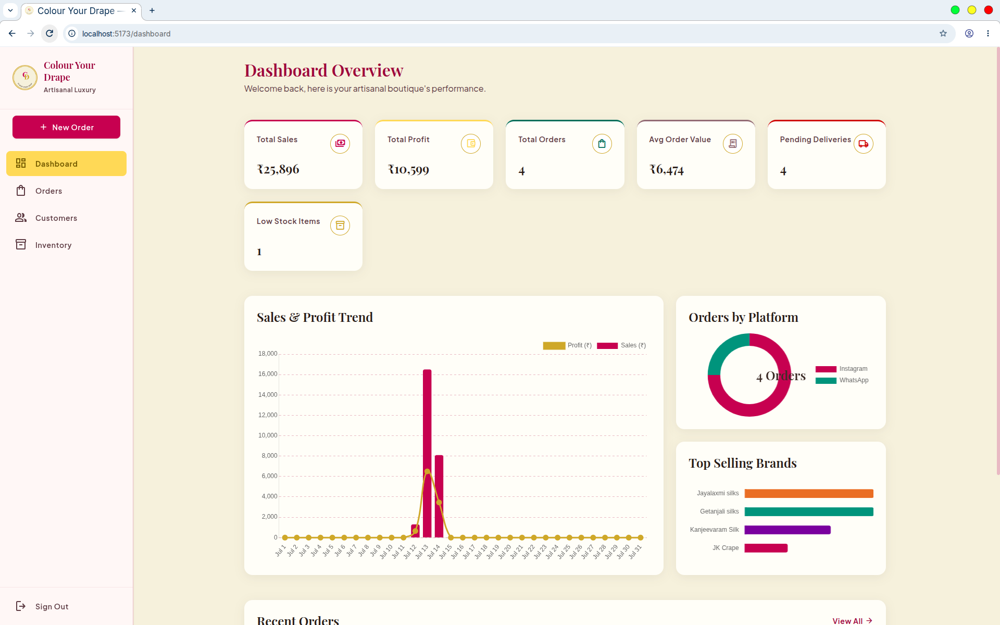
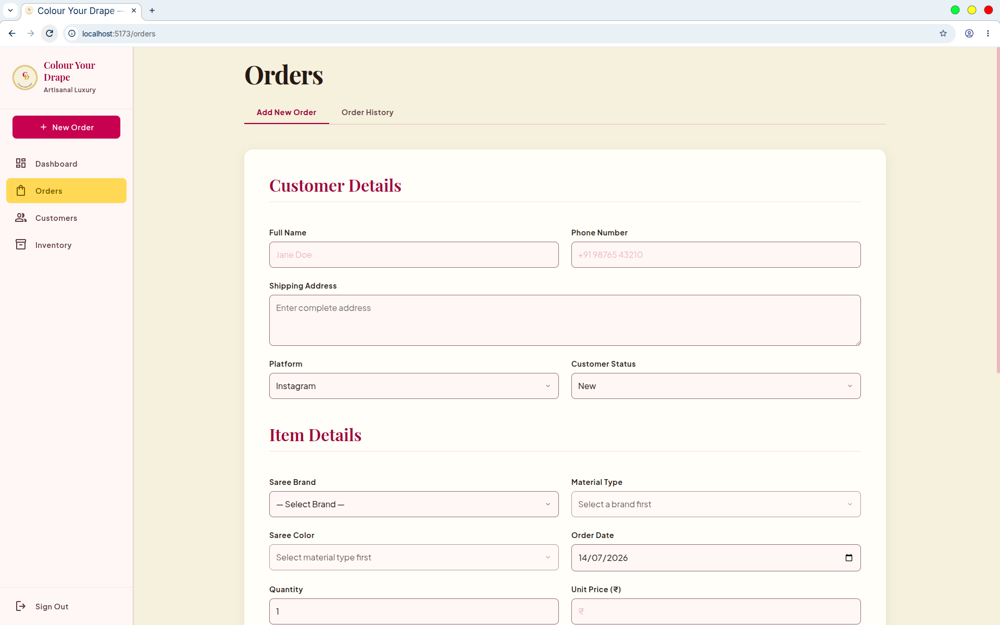
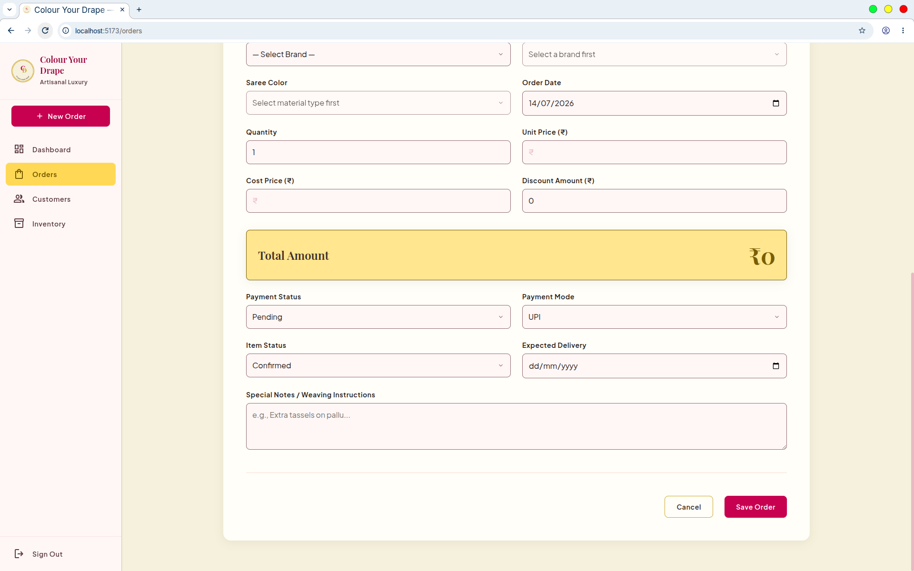
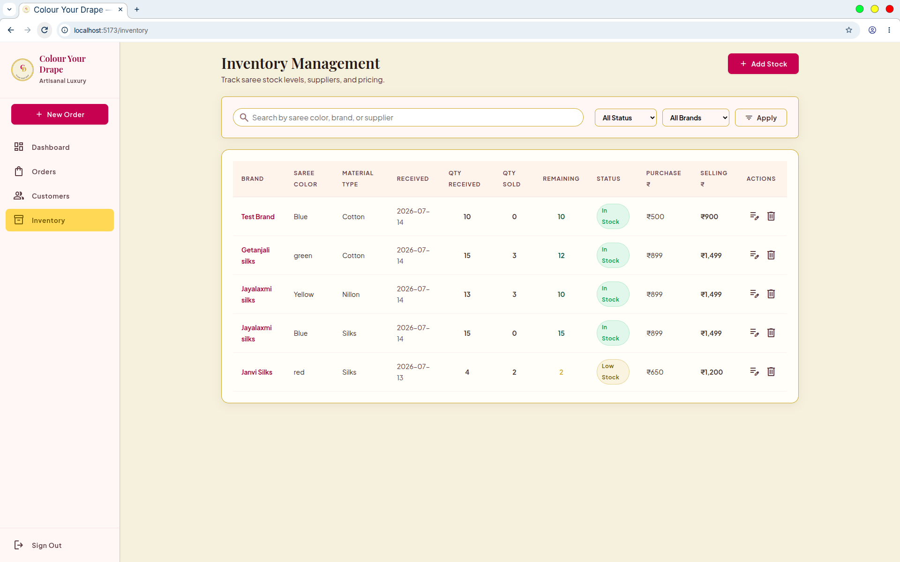
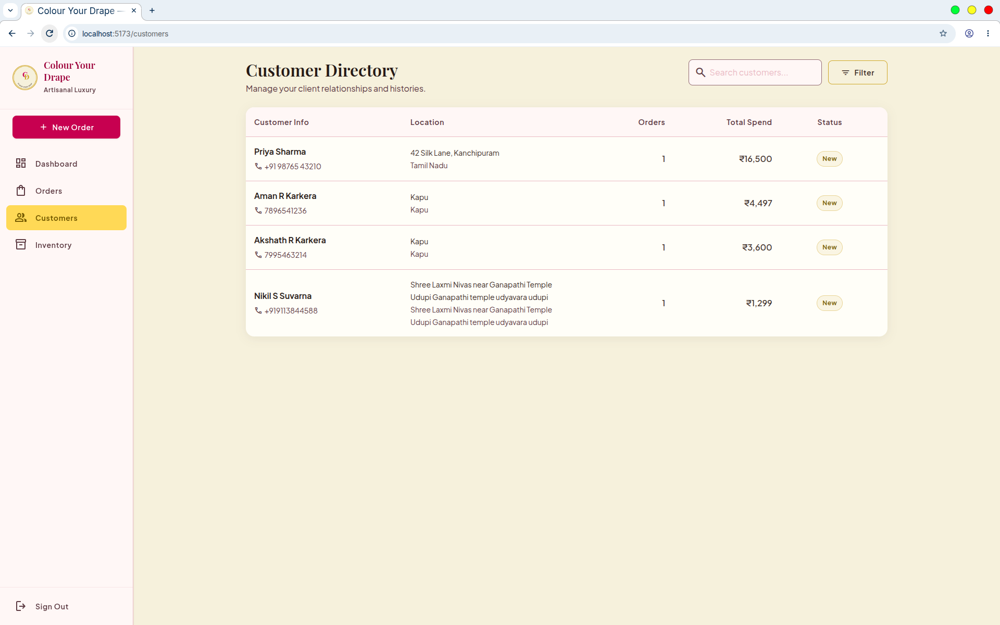

# Colour Your Drape — Business Dashboard

An internal business dashboard for **Colour Your Drape**, a saree business that sells via Instagram and WhatsApp. Built to track orders, customers, inventory, and sales/profit — replacing manual spreadsheet tracking with a real-time web app.

## Screenshots

### Dashboard


### Orders



### Inventory Management


### Customers


---

## Features

- **Secure Login** — JWT-based authentication with bcrypt password hashing (httpOnly cookies)
- **Dashboard** — KPIs (Total Sales, Profit, Orders, Avg Order Value, Pending Deliveries, Low Stock) with live charts:
  - Sales & Profit trend (daily/monthly time series)
  - Orders by Platform (Instagram vs WhatsApp)
  - Top Selling Brands
  - Orders by City
- **Orders** — Add new orders with customer + item details, order history with search/filter, edit/delete
- **Inventory Management** — Track stock by Brand, Material Type, and Saree Color; auto-calculated remaining stock and status (In Stock / Low Stock / Out of Stock)
- **Orders ↔ Inventory Integration** — Selecting a saree in an order automatically deducts from live inventory stock
- **Customers** — Auto-derived customer list with order history and total spend per customer

---

## Tech Stack

| Layer      | Technology                                      |
|------------|--------------------------------------------------|
| Frontend   | React (Vite)                                     |
| Backend    | Node.js + Express (REST API)                     |
| Database   | Firebase Firestore                               |
| Auth       | JWT + bcrypt (saltRounds = 10), httpOnly cookies |
| Validation | express-validator                                |

---

## Project Structure

```
color_your_drape/
├── backend/
│   ├── src/
│   │   ├── config/          # Firebase Admin SDK setup
│   │   ├── middleware/      # Auth guard, request validation
│   │   ├── routes/          # API routes (auth, orders, inventory, customers, dashboard)
│   │   └── scripts/         # One-time utility scripts
│   ├── server.js            # Express app entry point
│   ├── .env.example         # Environment variable template
│   └── serviceAccountKey.json  # Firebase Admin credentials (gitignored, not included)
├── frontend/
│   ├── src/
│   │   ├── pages/           # Dashboard, Orders, Inventory, Customers, Sign In
│   │   ├── components/      # Shared UI components
│   │   └── services/        # API client (axios)
│   └── vite.config.js
└── README.md
```

---

## Getting Started

### Prerequisites
- Node.js 18+
- A Firebase project with Firestore enabled
- npm

### 1. Clone the repository
```bash
git clone <your-repo-url>
cd color_your_drape
```

### 2. Backend setup
```bash
cd backend
npm install
cp .env.example .env
```

Fill in `.env` with your Firebase project config and a generated JWT secret:
```bash
openssl rand -hex 64   # use this output as JWT_SECRET
```

Place your Firebase Admin service account key as `backend/serviceAccountKey.json` (download from Firebase Console → Project Settings → Service Accounts → Generate new private key). **Never commit this file.**

Start the backend:
```bash
node server.js
```

### 3. Frontend setup
```bash
cd ../frontend
npm install
npm run dev
```

The app will be available at `http://localhost:5173` (or the port Vite assigns).

### 4. Create your first login
There is no public sign-up page (this is an internal tool). Create the first admin account via the API directly:
```bash
curl -X POST http://localhost:5000/api/auth/register \
  -H "Content-Type: application/json" \
  -d '{"email":"you@example.com","password":"YourStrongPassword123!","name":"Your Name"}'
```

---

## Environment Variables

See `backend/.env.example` for the full list. Required:

| Variable | Description |
|----------|-------------|
| `FIREBASE_API_KEY` | Firebase web app API key |
| `FIREBASE_AUTH_DOMAIN` | Firebase auth domain |
| `FIREBASE_PROJECT_ID` | Firebase project ID |
| `FIREBASE_STORAGE_BUCKET` | Firebase storage bucket |
| `FIREBASE_MESSAGING_SENDER_ID` | Firebase messaging sender ID |
| `FIREBASE_APP_ID` | Firebase app ID |
| `JWT_SECRET` | Random secret for signing JWTs |
| `PORT` | Backend server port (default 5000) |
| `NODE_ENV` | `development` or `production` |

**Note:** Firebase Admin credentials are loaded from `serviceAccountKey.json`, not from `.env` — keep this file local and never commit it.

---

## Security Notes

- This is an **internal business tool**, not a public-facing app — there is intentionally no public registration.
- `.env` and `serviceAccountKey.json` must never be committed (see `.gitignore`).
- Rotate your JWT secret and Firebase keys if they are ever accidentally exposed.

---

## License

Private project — not licensed for public use.